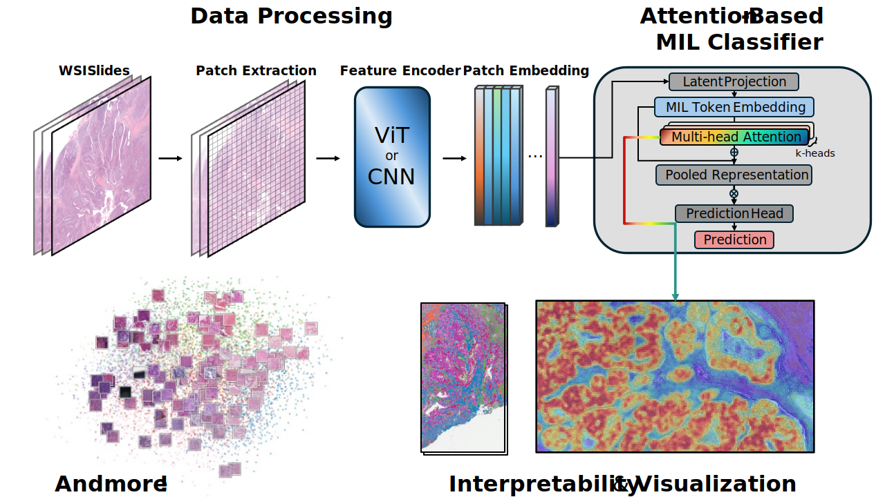
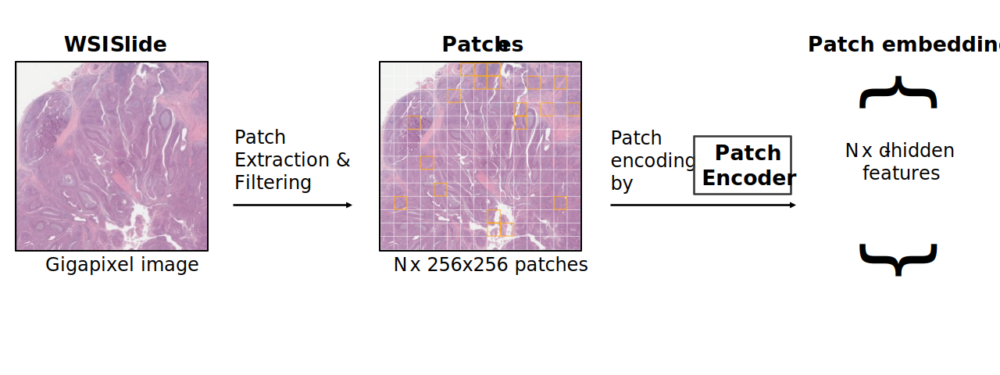

# Computational Pathology Tutorial

<p align="center">
  
</p>

A professional, beginner-friendly tutorial for learners with limited coding or limited medical background.  
The goal is simple: go from whole-slide images to trustworthy, interpretable predictions, then publish your work.

## Highlights

We are building an open-source set of core WSI resources for learners and researchers:

1. Precomputed UNI2-h features for TCGA WSIs  
Dataset: [huggingface page](https://huggingface.co/datasets/W8Yi/tcga-wsi-uni2h-features)  
Status: ongoing expansion toward full TCGA slide coverage.

2. Distilled WSI tile generative model  
Purpose: practical synthetic tile generation for data augmentation and education.

3. Our own DINOv3 encoder trained on WSI tiles  
Purpose: a strong in-house feature backbone aligned with pathology tile workflows.

## Data Access and Compute Notes

- The starter notebook runs on synthetic data and should work on CPU-only machines.
- Real WSI workflows may require downloading slides from [TCGA/GDC](https://portal.gdc.cancer.gov/), [CPTAC collections in IDC](https://portal.imaging.datacommons.cancer.gov/explore/collections), [PANDA on Kaggle](https://www.kaggle.com/competitions/prostate-cancer-grade-assessment), [TCIA](https://www.cancerimagingarchive.net/), or other open-source repositories.
- Precomputed TCGA UNI2-h features are available on [Hugging Face](https://huggingface.co/datasets/W8Yi/tcga-wsi-uni2h-features).
- Storage needs increase quickly for real-slide experiments (often tens to hundreds of GB depending on subset and artifacts).
- GPU is recommended for advanced encoder training and diffusion-based generation modules.

## Who This Is For

- Medical learners who want practical AI skills for pathology
- CS learners who need clinical and pathology context
- Educators building reproducible teaching materials

## What You Will Build

By the end of the core path, you will be able to produce:

- A baseline slide-level pathology prediction workflow
- A reproducible train/evaluation pipeline with standard metrics
- An attention-based interpretation artifact (for example, heatmaps/top-attended tiles)
- A case-study style write-up suitable for project reports or early manuscripts

## Prerequisites and Setup

Tested with Python 3.11.

```bash
python3 -m venv .venv
source .venv/bin/activate
python -m pip install --upgrade pip
python -m pip install numpy matplotlib scikit-learn notebook openslide-python torch torchvision cucim
```

OpenSlide may require system libraries. On Ubuntu/Debian:

```bash
sudo apt-get update && sudo apt-get install -y libopenslide0 openslide-tools
```

## Quick Start

Estimated time to first successful run: 40 to 60 minutes.

1. Read `00_start_here/README.md` (5 to 10 min).
2. Choose a path in `00_start_here/learning_paths.md` (5 min).
3. Run `02_hands_on/notebooks/01_tutorial_starter.ipynb` (30 to 45 min).
4. Complete `03_case_studies/01_guided` then `03_case_studies/02_capstone` (2 to 4+ hours).
5. Explore `04_advanced_topics/` for next-stage methods (optional).

## Pipeline Walkthrough

### 1) Data Processing

Purpose: prepare whole-slide image data for stable downstream modeling, including patch extraction and encoding.  
Output: preprocessing logs, patch sets/coordinates, encoded patch features, and slide-level bags for MIL.

<p align="center">
  
</p>

#### Patch Extraction

Purpose: split WSIs into meaningful tissue patches and remove low-value regions.  
Output: patch sets, coordinates, and extraction metadata.


#### Feature Encoding

Purpose: convert each patch into a compact numerical representation and organize features into slide-level bags.  
Output: encoded patch feature vectors and bagged embeddings for MIL training/evaluation.


### 2) Attention-Based MIL Classifier

Purpose: aggregate patch-level evidence into a slide-level representation.  
Output: attention scores, pooled representation, and slide-level logits.


### 3) Interpretability and Visualization

Purpose: make model decisions understandable to clinicians and technical teams.  
Output: attention heatmaps, top-attended tiles, and visual QA artifacts.

<p align="center">
  
</p>


### 4) Advanced Topics (Planned)

Purpose: expose learners to modern, high-impact research directions after they master the core workflow.

Coverage:
- Self-supervised foundation encoders (including UNI and related models)
- Diffusion models (for example, PixCell-style pipelines) to generate synthetic tiles
- Evaluation of real vs synthetic data for robustness, bias, and generalization


## Repository Map

```text
00_start_here/                   onboarding and learner pathways
01_foundations/                  bridge content organized as notebooks and code
02_hands_on/                     notebooks, source modules, configs, tests
03_case_studies/                 guided projects and capstone work
04_advanced_topics/              advanced methods and research extensions
assets/                          shared visuals and diagrams
data/                            tutorial-safe sample data and datasheets
glossary/                        plain-language definitions
references/                      reading lists and citations
community/                       contribution and learner support docs
```

## How To Cite This Tutorial

If this repository helps your work, please cite it.

1. Use GitHub's `Cite this repository` button (powered by `CITATION.cff`).
2. Or copy the BibTeX below.

```bibtex
@software{computational_pathology_tutorial,
  title        = {Computational Pathology Tutorial},
  author       = {{Weiyi Qin}},
  year         = {2026},
  version      = {0.1.0},
  url          = {https://github.com/W8Yi/Computational-Pathology-Tutorial},
  note         = {Beginner-friendly tutorial for computational pathology}
}
```

See `CITATION.cff` for machine-readable citation metadata.

## What We Cite

Current cited sources are tracked in:
- `references/cited_sources.md`

This currently includes:
- TCGA program/source context
- The precomputed UNI2-h TCGA feature dataset release
- Planned advanced-method references (UNI/UNI2 primary paper links and PixCell diffusion reference links to be pinned as modules are finalized)

## Project Status

- [x] Beginner-friendly project scaffold
- [x] Starter notebook template
- [x] Detailed pipeline README sections with stage visuals
- [ ] Full foundations module content
- [ ] First complete guided case study

## License

This repository is released under the [MIT License](LICENSE).
